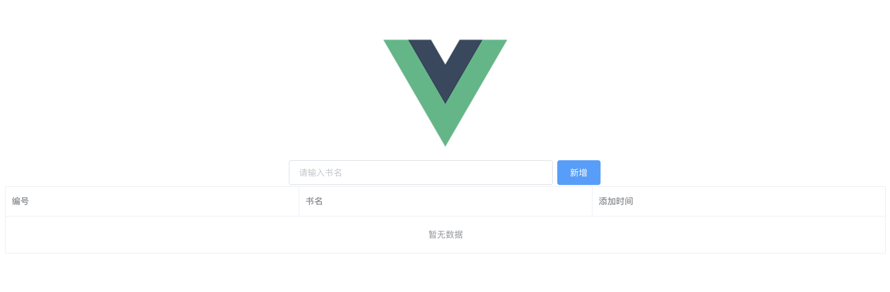

# vue-django

Integrate Django + Vue.js framework to quickly build web projects.

## Introduction

This is a practice project that display book.

## Usage

> django

```bash
python3 manage.py makemigrations
python3 manage.py migrate
python3 manage.py runserver 0.0.0.0:8000
```

> vue

Support you have installed `npm` command tool.

```bash
npm install
npm run build
npm run dev
```

## Web Presentation


